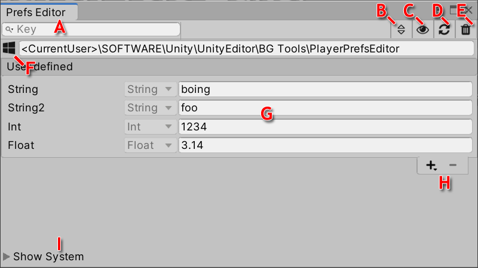
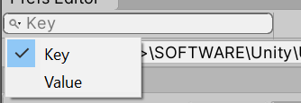

# PlayerPrefs Editor for Unity 3D

Tool extension for the Unity Editor that enables easy access to the player preferences over a simple UI. Allows to view, add, remove and modify entries on the development machine.

## Support

[GitHub](https://github.com/Dysman/bgTools-playerPrefsEditor) | [Website](https://www.bgtools.de/post/playerprefseditor/) | [Mail](mailto:support@bgtools.de) | [Discord](https://discord.gg/8rcPZrD)

## Features

* Add, remove and edit PlayerPrefs
* Intuitive visual editor
* Works with standard Unity PlayerPrefs
* Monitors changes from code
* Supports all editors (Windows, Linux, MacOS)
* Lightweight dockable for full integration in your workflow
* Supports both skins (Personal, Professional)

## Usage

The PlayerPrefs Editor is located in the top menu at Tools/BG Tools/PlayerPrefs Editor. It's a standard dockable window, so place it wherever it helps to be productive.

{ width=100% style="max-width:800px" }

The PlayerPrefs Editor window displays:
* (A) Filter field
* (B) Sort mode
* (C) Toggle 'System changes monitoring' behavior
* (D) Refresh data
* (E) Delete all data
* (F) Operating system and path to PlayerPrefs data
* (G) PlayerPrefs data list (Key, Type, Value)
* (H) Add/Remove a PlayerPrefs entry
* (I) Toggle visibility of system defined PlayerPrefs

### Modify Entries

The PlayerPrefs Editor allow to add, remove and edit PlayerPrefs data.

**Add a new entry**

Press the '+' button and select the type of the new PlayerPref entry. It's not possible to modify this type later. Add the key for the new entry in the upcoming dialog field. Additionally the dialog will provide feedback when it detected unintended overrides or invalid characters.

**Remove a existing entry**

Select the entry from the list that you want to delete. Press the '-' button to remove this entry. Confirm the warning dialog to finish the operation.

**Modify a existing entry**

To change a value of a existing entry do this directly in the value field in the PlayerPref list.

### Sort & Filter

**Sorting**

Circle trought the sorting funtions by pressing the (B) button in the toolbar.

Following sorting function are aviliable for the PlayerPref entries:
* None
* Ascending
* Descending

**Filtering**

Enter a text into the the search field (A) in the toolbar to filter the PlayerPrefs data list (G).

{ width=50% style="max-width:350px" }

Additionally select the mode for filtering by pressing on the magnifying glass icon in the search field. Choose between filtering the existing PlayPrefs by key or value. The current search target will be shown in the searchfield if no search string is present.

### Monitoring system changes

The plugin can monitor changes at runtime automatically and keep the view up-to-date. This detection is active by default, but it can be turned off over the (C) button in the toolbar.

## Samples

This package includes two samples for testing purposes:

**Test Value Menu**
> Adds new entries into the top menu Tools/BG Tools/PlayerPrefs Test Values. This allows easily to add text values to the PlayerPrefs of the current project.

**Sample Scene**
> Simple UI that manipulates PlayerPrefs entries on runtime.

## Technical details
### Requirements

This version of PlayerPrefs Editor is compatible with the following versions of the Unity Editor:

> 2019.4 and later (recommended)  
> Windows, MacOS, Linux

### Limitations MacOS

Due to technical on MacOS it take time to update the persistent file that stores the PlayerPrefs. To avoid inconsistent data the plugin will show a loading screen until the data can be fully refreshed. Sorry for the inconvenience.

Keep in mind that it's possible to deactivate the automatic refresh in the settings.